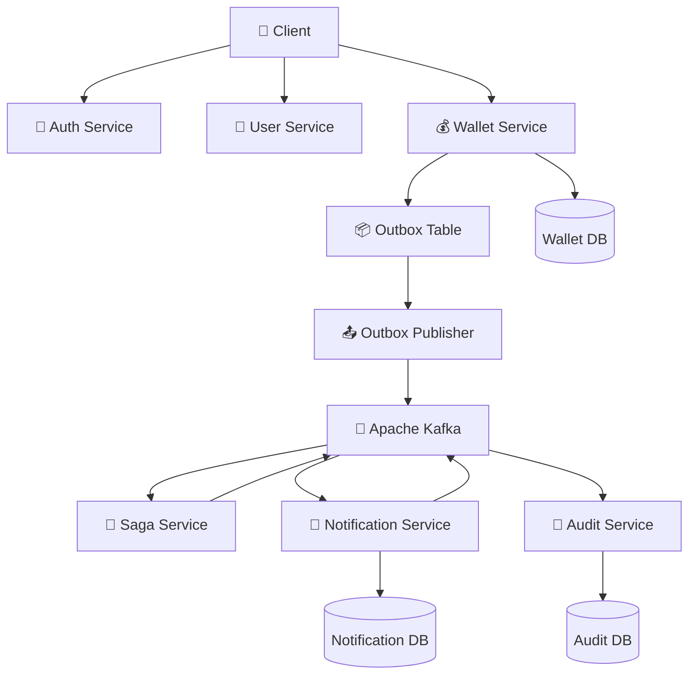
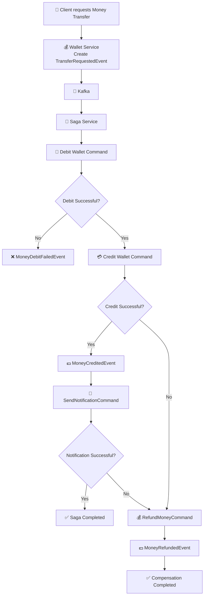

# 💳 PayFlow

**PayFlow** is a production-inspired **Spring Boot Microservices** backend project that demonstrates how modern payment systems are designed using **event-driven architecture** and enterprise backend patterns.

The project is built as a hands-on learning journey to understand how real-world financial systems manage authentication, wallet operations, distributed transactions, notifications, and audit logging while maintaining scalability and reliability.

---

# 🚀 Features

* 🔐 JWT Authentication & Authorization
* 🔄 Refresh Token Support
* 👤 User Profile Management
* 💰 Wallet Creation & Balance Management
* 💸 Money Transfer Between Wallets
* 📜 Transaction History
* 📡 Apache Kafka Event-Driven Communication
* 🔁 Choreography Saga Pattern
* 📦 Transactional Outbox Pattern
* ⚡ Redis Cache Integration
* 🔔 Notification Service
* 📝 Audit Logging Service
* 📖 Swagger / OpenAPI Documentation
* 🐳 Docker Support
* ✅ Unit & Integration Testing

---

# 🏗️ Microservices

| Service              | Responsibility                                                  |
| -------------------- | --------------------------------------------------------------- |
| Auth Service         | User registration, login, JWT authentication and refresh tokens |
| User Service         | User profile management                                         |
| Wallet Service       | Wallet creation, balance management, transactions               |
| Saga Service         | Distributed transaction orchestration through Kafka events      |
| Notification Service | Creates notifications after successful transactions             |
| Audit Service        | Stores audit logs for important business events                 |
| Gateway Service      | Single entry point for routing and request filtering            |
| Eureka Service       | Service discovery and registration for all microservices        |
| Config Service       | Centralized configuration management for the application        |

---

# 🛠️ Technology Stack

| Technology        | Purpose                        |
| ----------------- | ------------------------------ |
| Java 21           | Programming Language           |
| Spring Boot       | Microservice Framework         |
| Spring Security   | Authentication & Authorization |
| JWT               | Secure Token Authentication    |
| Spring Data JPA   | Database Access                |
| MySQL             | Persistent Storage             |
| Apache Kafka      | Event Streaming                |
| Redis             | Caching                        |
| Spring Cloud      | Microservices Infrastructure   |
| Docker            | Containerization               |
| Swagger / OpenAPI | API Documentation              |
| JUnit 5           | Unit & Integration Testing     |

---

# 📌 Project Goals

The main objective of PayFlow is to understand and implement enterprise backend concepts including:

* Microservices Architecture
* Event-Driven Communication
* Distributed Transactions
* Saga Pattern
* Transactional Outbox Pattern
* Idempotent Consumers
* Redis Caching
* Secure Authentication using JWT
* REST API Design
* Service Discovery with Eureka
* Centralized Configuration with Config Server
* API Gateway Routing
* Docker-based Deployment
* API Documentation with Swagger

---

# 📚 Learning Objectives

This project focuses on practical implementation of:

* Spring Boot
* Spring Security
* Spring Data JPA
* Spring Cloud Gateway
* Eureka Service Discovery
* Spring Cloud Config
* Kafka
* Redis
* Docker
* Swagger/OpenAPI
* Distributed System Design
* Enterprise Backend Best Practices

---

> **Note**
>
> This project is built as a learning-focused implementation inspired by enterprise backend architectures. The design will continue evolving with Kubernetes deployment, CI/CD pipelines, observability, and cloud-native practices.

---

                     🏛️ System Architecture

                ▼                  ▼                  ▼
        Wallet Commands     Notification DB       Audit Database
                │
                ▼
         Wallet Service

## Architecture Overview

PayFlow follows an event-driven microservices architecture.

The client interacts with the Wallet, Auth, and User services through REST APIs.

The Wallet Service persists transactions and writes integration events into an Outbox table.

An Outbox Publisher asynchronously publishes these events to Apache Kafka, ensuring reliable event delivery.

The Saga Service orchestrates distributed transactions by coordinating debit, credit, notification, and compensation workflows.

Notification Service generates user notifications and publishes notification events.

Audit Service consumes business events and stores immutable audit logs for traceability.

---

# 🔄 Saga Pattern Workflow

         
