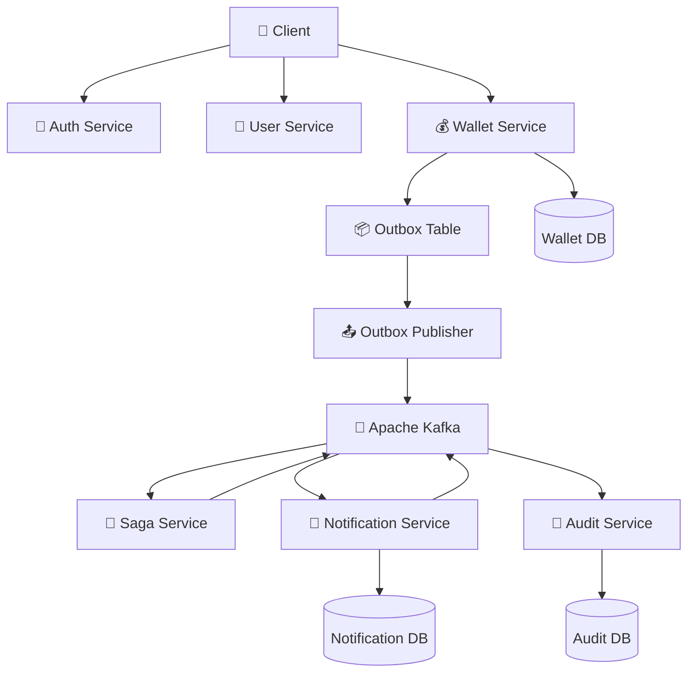
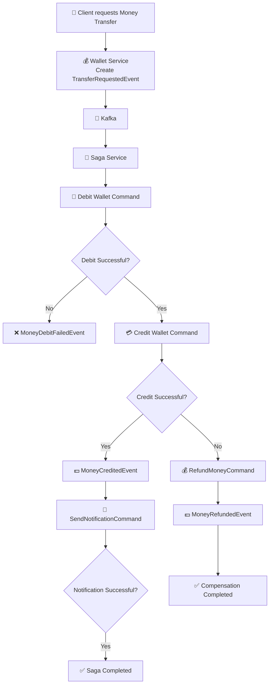
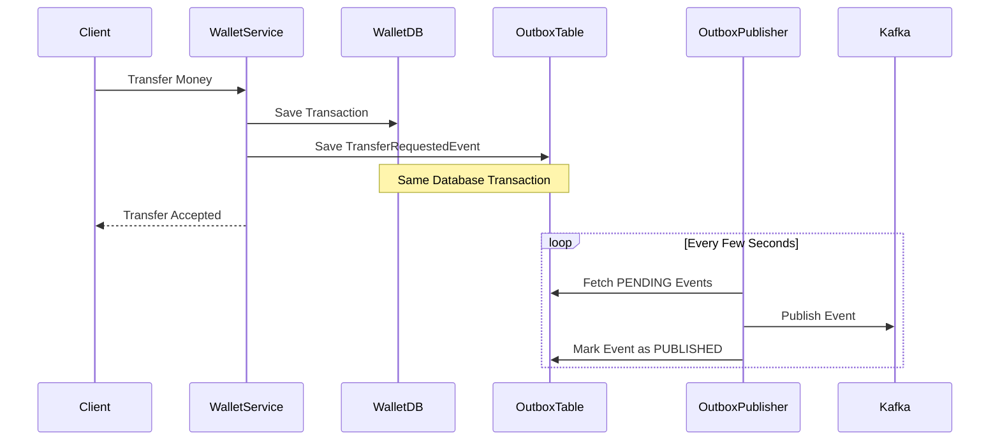
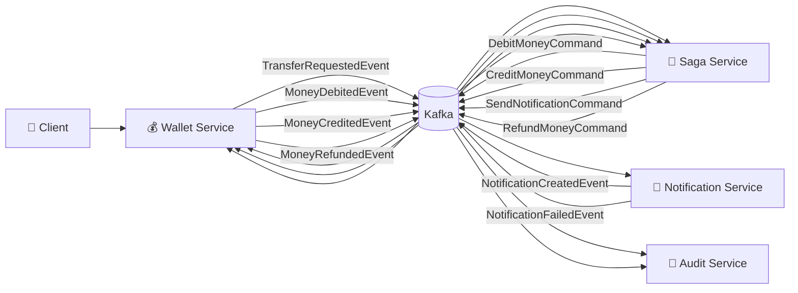
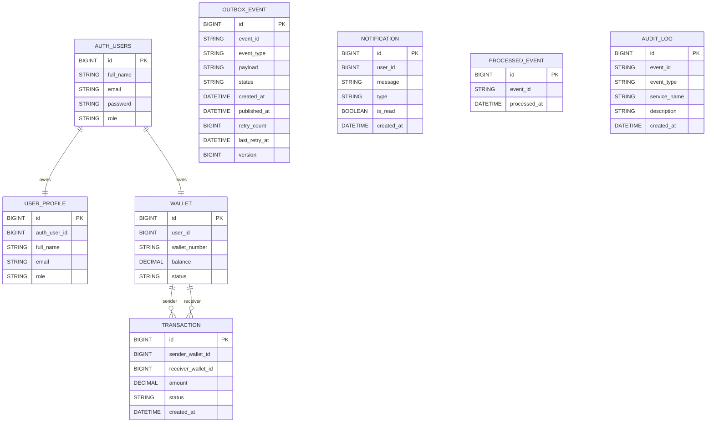

# 💳 PayFlow


---

# 💳 PayFlow

**PayFlow** is a production-inspired **Spring Boot Microservices** backend project that demonstrates how modern payment systems are designed using **event-driven architecture** and enterprise backend patterns.

The project is built as a hands-on learning journey to understand how real-world financial systems manage authentication, wallet operations, distributed transactions, notifications, and audit logging while maintaining scalability and reliability.

---

# 🚀 Features

* 🔐 JWT Authentication & Authorization
* 🔄 Refresh Token Support
* 👤 User Profile Management
* 💰 Wallet Creation & Balance Management
* 💸 Money Transfer Between Wallets
* 📜 Transaction History
* 📡 Apache Kafka Event-Driven Communication
* 🔁 Choreography Saga Pattern
* 📦 Transactional Outbox Pattern
* ⚡ Redis Cache Integration
* 🔔 Notification Service
* 📝 Audit Logging Service
* 📖 Swagger / OpenAPI Documentation
* 🐳 Docker Support
* ✅ Unit & Integration Testing

---

# 🏗️ Microservices

| Service              | Responsibility                                                  |
| -------------------- | --------------------------------------------------------------- |
| Auth Service         | User registration, login, JWT authentication and refresh tokens |
| User Service         | User profile management                                         |
| Wallet Service       | Wallet creation, balance management, transactions               |
| Saga Service         | Distributed transaction orchestration through Kafka events      |
| Notification Service | Creates notifications after successful transactions             |
| Audit Service        | Stores audit logs for important business events                 |
| Gateway Service      | Single entry point for routing and request filtering            |
| Eureka Service       | Service discovery and registration for all microservices        |
| Config Service       | Centralized configuration management for the application        |

---

# 🛠️ Technology Stack

| Technology        | Purpose                        |
| ----------------- | ------------------------------ |
| Java 17           | Programming Language           |
| Spring Boot       | Microservice Framework         |
| Spring Security   | Authentication & Authorization |
| JWT               | Secure Token Authentication    |
| Spring Data JPA   | Database Access                |
| MySQL             | Persistent Storage             |
| Apache Kafka      | Event Streaming                |
| Redis             | Caching                        |
| Spring Cloud      | Microservices Infrastructure   |
| Docker            | Containerization               |
| Swagger / OpenAPI | API Documentation              |
| JUnit 5           | Unit & Integration Testing     |

---

# 📌 Project Goals

The main objective of PayFlow is to understand and implement enterprise backend concepts including:

* Microservices Architecture
* Event-Driven Communication
* Distributed Transactions
* Saga Pattern
* Transactional Outbox Pattern
* Idempotent Consumers
* Redis Caching
* Secure Authentication using JWT
* REST API Design
* Service Discovery with Eureka
* Centralized Configuration with Config Server
* API Gateway Routing
* Docker-based Deployment
* API Documentation with Swagger

---

# 📚 Learning Objectives

This project focuses on practical implementation of:

* Spring Boot
* Spring Security
* Spring Data JPA
* Spring Cloud Gateway
* Eureka Service Discovery
* Spring Cloud Config
* Kafka
* Redis
* Docker
* Swagger/OpenAPI
* Distributed System Design
* Enterprise Backend Best Practices

---

> **Note**
>
> This project is built as a learning-focused implementation inspired by enterprise backend architectures. The design will continue evolving with Kubernetes deployment, CI/CD pipelines, observability, and cloud-native practices.

---

                     🏛️ System Architecture


                ▼                  ▼                  ▼
        Wallet Commands     Notification DB       Audit Database
                │
                ▼
         Wallet Service

## Architecture Overview

PayFlow follows an event-driven microservices architecture.

The client interacts with the Wallet, Auth, and User services through REST APIs.

The Wallet Service persists transactions and writes integration events into an Outbox table.

An Outbox Publisher asynchronously publishes these events to Apache Kafka, ensuring reliable event delivery.

The Saga Service orchestrates distributed transactions by coordinating debit, credit, notification, and compensation workflows.

Notification Service generates user notifications and publishes notification events.

Audit Service consumes business events and stores immutable audit logs for traceability.

---

# 🔄 Saga Pattern Workflow



---

      # 📦 Transactional Outbox Pattern



---
## Why Transactional Outbox?

Without the Outbox Pattern, the following issue can occur:

1. Wallet transaction is committed.
2. Kafka is unavailable.
3. Event is never published.
4. Other services never receive the event.

This causes data inconsistency across microservices.

To solve this, PayFlow uses the Transactional Outbox Pattern.

- The wallet transaction and integration event are stored in the same database transaction.
- An Outbox Publisher periodically scans the Outbox table.
- Pending events are published to Kafka.
- Successfully published events are marked as `PUBLISHED`.

This guarantees reliable event delivery even if Kafka is temporarily unavailable.

---

# 📡 Kafka Topics Flow



## Kafka Communication Flow

PayFlow uses Apache Kafka as the communication backbone between microservices.

Instead of calling each service synchronously using REST APIs, services communicate by publishing and consuming events.

This provides:

- Loose coupling
- Better scalability
- Asynchronous processing
- Fault tolerance
- Independent deployments
- Event-driven architecture

Each service owns its own database and communicates only through Kafka events.

---

# 🗄️ Database Design


## Database Ownership

Each microservice owns its own database.

| Service | Database Tables |
|----------|-----------------|
| Auth Service | users |
| User Service | user_profile |
| Wallet Service | wallet, transaction, outbox_event |
| Notification Service | notification, processed_event |
| Audit Service | audit_log |

No service directly accesses another service's database.

All communication happens through Kafka events.

---

# 🐳 Docker Setup

## Prerequisites

- Docker
- Docker Compose
- Java 17
- Maven 3.9+

## Build all services

```bash
mvn clean package
```

## Start Infrastructure

```bash
docker-compose up -d
```

This starts:

- Apache Kafka
- Zookeeper
- MySQL
- Redis

## Run Spring Boot Services

```bash
mvn spring-boot:run
```

or run each service individually from your IDE.

---

# 📖 Swagger Documentation

Each microservice exposes OpenAPI documentation.

| Service | Swagger URL |
|----------|-------------|
| Auth Service | http://localhost:8081/swagger-ui/index.html |
| User Service | http://localhost:8082/swagger-ui/index.html |
| Wallet Service | http://localhost:8083/swagger-ui/index.html |
| Saga Service | Internal Event Service |
| Notification Service | Internal Event Service |
| Audit Service | Internal Event Service |

> Saga, Notification and Audit are event-driven services and therefore do not expose REST APIs for business operations.


---

# 🧪 Testing

The project contains automated tests covering:

- Unit Tests
- Service Layer Tests
- Repository Tests
- Controller Tests
- Kafka Integration Tests
- Compensation Flow Tests

Run all tests:

```bash
mvn test
```

Generate test report:

```bash
mvn verify
```

---

# 🚀 Running PayFlow

## Clone Repository

```bash
git clone https://github.com/RAGHUVANSHI2024/PayFlow-V2
```

## Move into project

```bash
cd PayFlow
```

## Build

```bash
mvn clean install
```

## Start Docker

```bash
docker-compose up -d
```

## Start all Spring Boot services

Run each microservice.

Then open Swagger.

Example:

```
http://localhost:8083/swagger-ui/index.html
```

Create:

1. User
2. Wallet
3. Transfer Money

Observe:

- Kafka Events
- Saga Execution
- Notification Creation
- Audit Logs

---

# 📂 Project Structure

```
PayFlow
│
├── auth-service
├── user-service
├── wallet-service
├── saga-service
├── notification-service
├── audit-service
│
├── docker-compose.yml
├── README.md
│
└── docs
      ├── architecture
      ├── diagrams
      └── screenshots
```

---

# 🔮 Future Improvements

Future enhancements planned for PayFlow include:

- Distributed Tracing (Zipkin)
- Centralized Logging (ELK Stack)
- Prometheus + Grafana Monitoring
- Kubernetes Deployment
- GitHub Actions CI/CD
- Helm Charts
- Resilience4j Circuit Breakers
- Distributed Locking
- Idempotency Keys
- OAuth2 Authentication
- Cloud Deployment (AWS)

---

# 🌍 Complete Business Flow

1. User registers
2. User logs in
3. JWT token generated
4. Wallet created
5. User transfers money
6. Wallet publishes TransferRequestedEvent
7. Saga coordinates transaction
8. Notification sent
9. Audit log stored
10. Transaction completed

---

# 🛠 Technologies

## Backend

- Java 17
- Spring Boot
- Spring Security
- Spring Data JPA
- Spring Validation

## Messaging

- Apache Kafka

## Database

- MySQL

## Cache

- Redis

## Documentation

- Swagger / OpenAPI

## Containerization

- Docker

## Architecture

- Microservices
- Saga Pattern
- Transactional Outbox
- Event Driven Architecture

---

# 📚 What I Learned

During the development of PayFlow I learned:

- Designing Microservices
- Event Driven Architecture
- Apache Kafka
- Saga Pattern
- Compensation Transactions
- Transactional Outbox
- Redis Caching
- JWT Authentication
- Swagger Documentation
- Docker
- Clean Architecture

---
# 📜 License

This project is built for educational and portfolio purposes.

Feel free to fork and learn from it.
